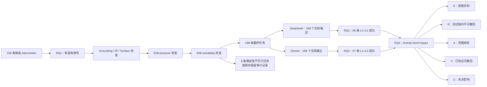
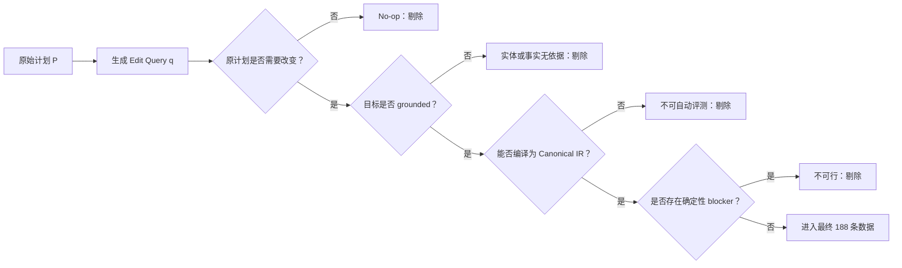
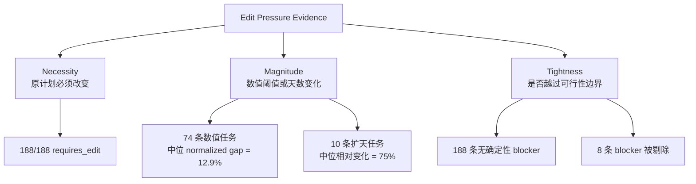
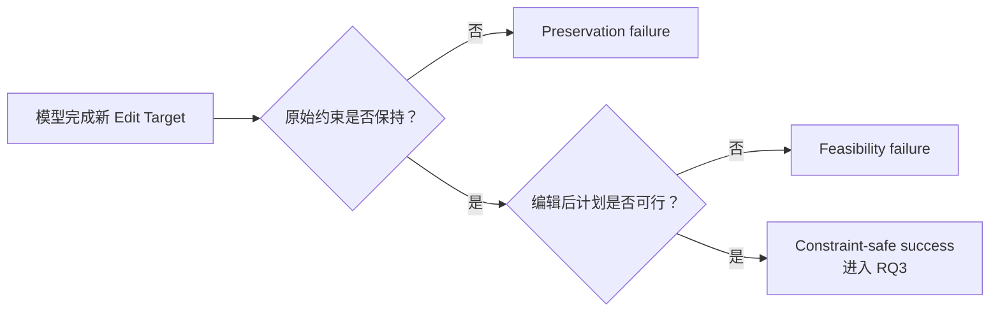
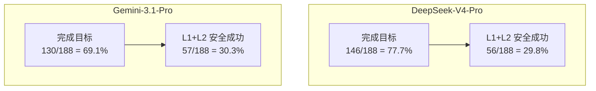
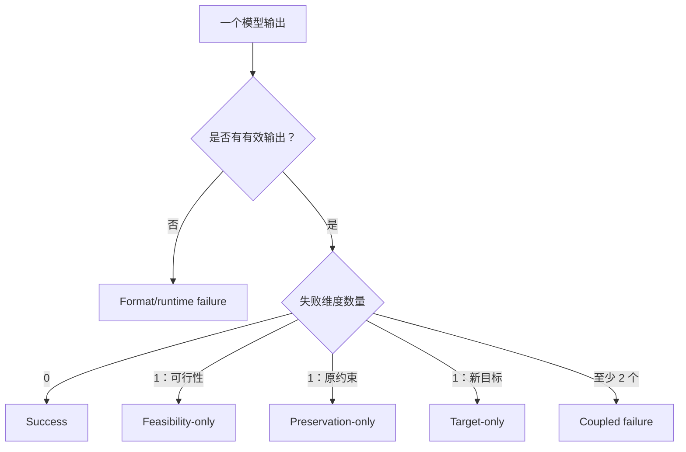
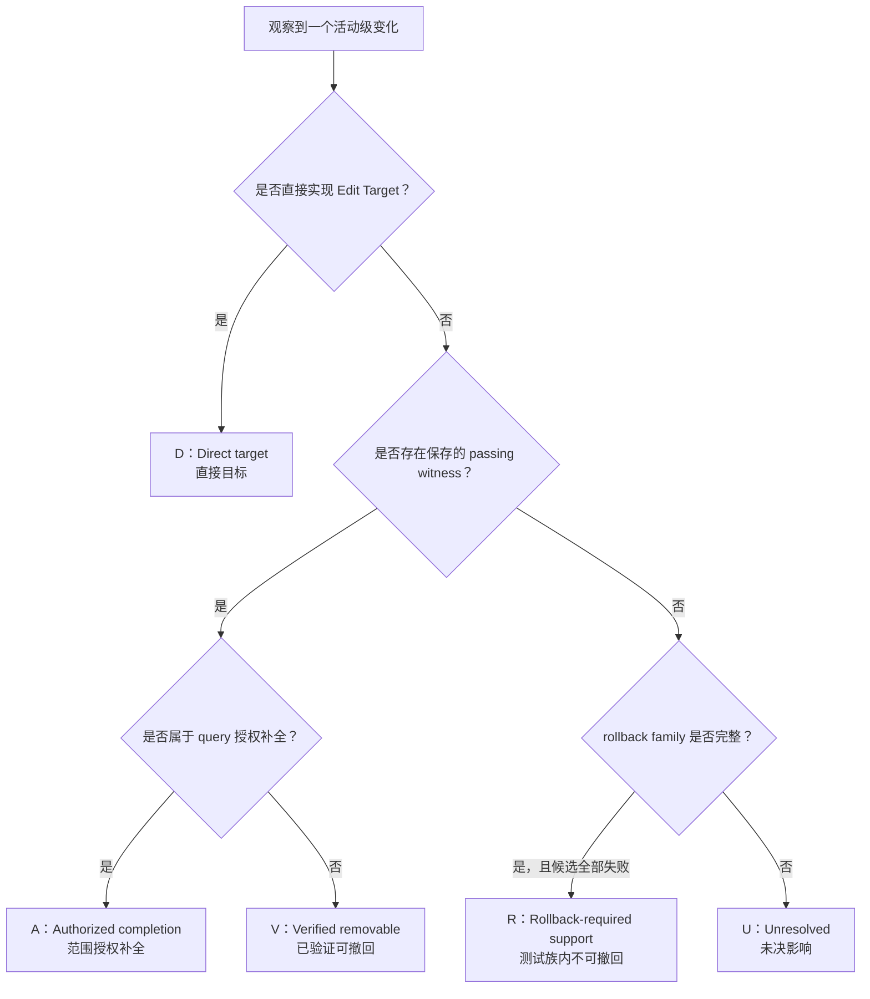
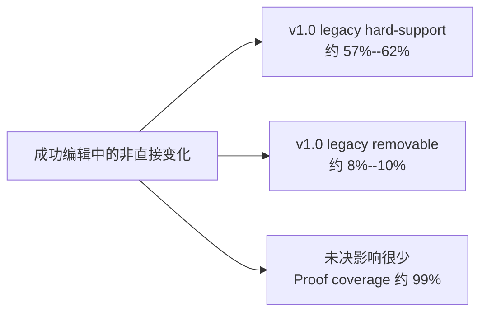
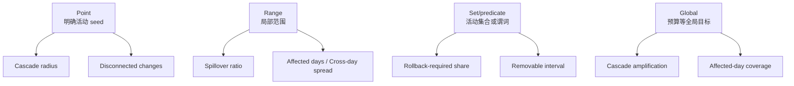

# Constraint-Grounded Edit-Impact Evaluation：问题设置与传播形态设计

## 研究目标

本研究关注：

- **Activity-level Edit-Impact Profile**
- **Observable Dependency Spread**

本文档首先固定两个已经确认的设计判断：

1. 数据生成与编辑影响评测属于两个不同阶段；
2. 不同 query 对应不同形态的 dependency spread，这种异质性是 benchmark 的现实性与覆盖面，而不是缺陷。

本文档同时区分数据集质量分析与模型输出评测，并固定最终 188 条数据、
两模型失败机制以及四种 intervention shape 的传播分析口径。

## 1. 数据生成与评测的边界

Query 生成框架本身不负责产生编辑后计划，也不负责比较原计划和编辑后计划。它的作用是为后续评测构造一个具有明确干预语义、真实编辑压力和可验证目标的问题设置。

整个过程分成三个阶段。

### 1.1 数据生成

给定原计划 $P$ 及其原始请求约束 $C_0$，数据生成阶段：

1. 基于原计划和数据库证据生成 edit query $q$；
2. 将自然语言 query 编译并冻结为可验证的编辑约束 $C_q$；
3. 发布评测样本 $(P,C_0,q,C_q)$。

这一阶段定义的是：

> 模型面对的干预是什么，以及该干预在约束层面意味着什么。

### 1.2 模型执行

模型接收原计划 $P$ 和 edit query $q$，生成编辑后计划：

$$
P' = M(P,q)
$$

### 1.3 评测

评测阶段才负责：

1. 检查 $P'$ 是否保持整体可行性和未被修改的原请求约束；
2. 检查 $P'$ 是否满足冻结的编辑约束 $C_q$；
3. 比较 $P$ 与 $P'$，得到活动级变化集合 $\Delta(P,P')$；
4. 构造 Activity-level Edit-Impact Profile；
5. 分析 Observable Dependency Spread。

因此，query 生成框架与研究目标之间的关系不是“生成阶段直接完成影响评测”，而是：

> **数据生成负责定义 constraint-grounded intervention；评测负责观察模型如何响应这一 intervention。**

## 2. 不同 query 对应不同形态的 Dependency Spread

现实中的编辑请求并不都从一个明确活动出发。不同 query 天然定义了不同的干预范围和依赖传播形态。因此，query 的异质性不是评测噪声或数据集缺陷，而是 benchmark 覆盖现实编辑场景的重要设计。

当前 query 可以从传播形态上理解为：

| 干预形态 | 示例 | 对应的传播问题 |
|---|---|---|
| 点触发（point-triggered） | “把雷峰塔从行程中删除” | 一个明确活动发生变化后，影响传播到了哪些其他活动和日期？ |
| 范围触发（range-triggered） | “把西湖周边活动限制在 3 公里内” | 一个局部范围的调整是否进一步扩散到目标范围之外？ |
| 集合触发（set/predicate-triggered） | “增加一个历史文化类景点” | 模型为满足某个类型或谓词要求所选择的活动，连带影响了哪些非目标活动？ |
| 全局触发（global-triggered） | “总预算不超过 800 元” | 一个全局约束如何在多个活动、日期和资源维度之间引发分散或联合调整？ |

这四类 query 都可以接受活动级影响分析，但它们对应的传播结构不同：

- 点触发 query 具有明确的活动 seed，适合研究从目标活动向外扩展的传播；
- 范围触发 query 的起点是一个局部影响面，适合研究范围内变化和范围外溢出；
- 集合触发 query 的目标是满足某个谓词的活动集合，适合研究目标集合内外的影响分布；
- 全局触发 query 没有唯一局部 seed，适合研究修改覆盖面、跨日影响以及修改的集中或分散程度。

因此，不应把 query 简单分成“支持传播评测”和“不支持传播评测”，也不应强迫所有 query 使用完全相同的传播指标。更合理的设计是：

> **所有成功完成编辑的样本都进入统一的 Activity-level Edit-Impact Evaluation；随后根据 query 的干预形态，分析相应形式的 Observable Dependency Spread。**

## 3. Query 生成框架与研究目标的关系

Query 生成框架通过以下方式为后续评测提供基础：

1. 从原计划出发构造 query，使编辑具有明确的修改前参照；
2. 使用原计划或数据库中的实体与数值，使干预落在真实、可验证的对象上；
3. 根据原计划状态设置编辑参数，使 query 产生真实的修改压力；
4. 将自然语言 query 冻结为结构化约束，使编辑成功可以被程序验证；
5. 覆盖点、范围、集合和全局四类干预形态，使 benchmark 能够观察现实中不同形式的依赖传播。

这一关系可以概括为：

> **Query generation defines heterogeneous, constraint-grounded interventions; evaluation observes how each form of intervention propagates through the plan.**

中文表述为：

> **Query 生成框架定义具有不同作用范围的约束驱动干预；评测框架则观察每种干预如何在计划内部产生和传播影响。**

## 4. 当前设计原则

后续传播度量需要遵守以下原则：

1. Activity-level Edit-Impact Profile 是所有成功编辑样本的统一基础；
2. Dependency Spread 的具体度量应适配 query 的干预形态；
3. 不应为没有唯一局部起点的 query 人为指定一个传播 seed；
4. 不同传播形态应共享一组可比较的基础指标，同时允许使用类型特定指标；
5. Observable Dependency Spread 描述可从活动关系、约束验证和局部反事实中观察到的传播模式，不将其表述为真实因果关系的证明。

## 5. 数据集质量分析

### 5.1 数据集质量与模型评测是两个不同对象

数据集质量分析只使用：

$$
(P,C_0,q,C_q)
$$

它回答：

> 这条样本是否被正确构造，能否稳定、有效地支持后续的编辑影响评测？

模型输出评测还需要模型生成的编辑后计划 $P'$，并分析：

$$
\Delta(P,P')
$$

它回答：

> 模型完成编辑时产生了哪些变化，以及这些变化如何分布和传播？

因此，可以使用下面的简单判定规则：

> **不依赖模型输出 $P'$ 的指标属于数据集质量分析；依赖 $P'$ 或 $\Delta(P,P')$ 的指标主要属于模型行为评测。**

例如，四类 query 的覆盖率、目标落地率、编辑压力有效率和约束可验证率属于数据集质量；Activity Change Ratio、$D/R/A/V/U$、影响集中度和传播半径属于模型评测。

### 5.2 数据集质量指标

#### 1. Intervention Coverage

检查数据集是否覆盖现实中的不同干预形态。

对于干预类型 $t$：

$$
R_{\mathrm{coverage},t}
=
\frac{N_t}{N}
$$

其中 $N_t$ 是该类型的样本数，$N$ 是数据集总样本数。

需要报告：

- 点、范围、集合/谓词和全局四类样本的数量与比例；
- 每类包含的具体 constraint type 数量；
- 每类在 temporal、spatial、resource、semantic、structural 等内容维度上的分布；
- 是否存在某一类过少，无法形成稳定分析。

Coverage 不要求四类完全均匀。重点是四类都有足够覆盖，并且不由少数模板重复构成。

#### 2. Grounding Validity

检查 query 中的目标是否能落到原计划或外部数据库证据上。

对于类型 $t$：

$$
R_{\mathrm{ground},t}
=
\frac{N_{\mathrm{grounded},t}}{N_t}
$$

四类 query 的检查对象不同：

| 干预类型 | Grounding 要求 |
|---|---|
| 点触发 | 指定名称或活动对能够解析到唯一的原计划活动或数据库实体 |
| 范围触发 | anchor、目标日期、空间半径或局部边界能够被明确解析 |
| 集合/谓词触发 | 类型或谓词存在可执行 verifier，且数据库中存在合法候选 |
| 全局触发 | 总预算、总时间、总门票等目标能够由计划字段稳定计算 |

Grounding 失败的样本不应进入正式 benchmark。

#### 3. Edit-Pressure Validity

检查原计划是否真的需要发生变化才能满足 edit query，避免生成 no-op task。

对于数值约束，可以保存：

$$
\mathrm{PressureMargin}
=
\left|
\mathrm{ObservedValue}
-
\mathrm{RequestedBound}
\right|
$$

同时检查方向是否正确。例如，生成“总预算不超过 800 元”时，原计划预算必须高于 800 元。

对于实体或结构编辑，则检查：

- 新增实体在原计划中不存在；
- 删除实体在原计划中存在；
- 替换目标与原实体不同；
- 增加天数确实高于原计划天数；
- 时间、空间或资源边界相对于原计划形成非零编辑压力。

对于类型 $t$：

$$
R_{\mathrm{pressure},t}
=
\frac{N_{\mathrm{valid\ pressure},t}}{N_t}
$$

除通过率外，还应报告 Pressure Margin 的分布，避免样本全部处于几乎无压力或极端不可行的区域。

#### 4. Constraint Checkability

检查自然语言 query 是否能够稳定转换为程序可执行的编辑约束。

需要报告：

- Canonical IR 构建成功率；
- Frozen target 编译成功率；
- Frozen target 重建一致率；
- Verifier 支持率；
- Surface rewrite 前后目标保持率；
- Unsupported constraint 数量与类型。

核心指标为：

$$
R_{\mathrm{checkable},t}
=
\frac{N_{\mathrm{supported\ and\ reproducible},t}}{N_t}
$$

这一指标直接决定数据集能否进行低成本、可批处理和一致口径的自动评测。

#### 5. Intervention-Shape Label Validity

检查点、范围、集合/谓词和全局四类标签是否稳定、可复现。

需要固定：

- 每个 constraint type 到四类干预形态的映射；
- 复合 query 的分类优先级；
- 边界案例的处理方式；
- 映射是否覆盖全部 query type，以及相同规则重跑是否得到相同标签。

复合 query 采用保守原则：

> **按照完成整条 query 所需的最不局部约束进行分类。**

例如，“增加雷峰塔，同时要求所有景点之间交通时间不超过 30 分钟”虽然包含明确实体，但整体作用范围由全局交通约束决定，不能仅因为出现“雷峰塔”就归为点触发。

四类标签是 benchmark 预先定义的 intervention taxonomy，而不是从样本
内容中事后推断的主观标注。因此不进行人工标签验证，也不报告
inter-annotator agreement。实现层面的充分检查是：映射表覆盖全部
query type、复合规则固定、196 条样本均能确定性归类，且重跑结果一致。

#### 6. Type-Specific Evaluation Readiness

检查每条 query 是否提供了其传播形态所需的评测信息。

| 干预类型 | 需要具备的评测信息 |
|---|---|
| 点触发 | 可解析的 seed activity 或 seed activity set |
| 范围触发 | 可解析的目标范围、anchor 或边界 |
| 集合/谓词触发 | 可执行的 predicate verifier 与冻结的语义标签版本 |
| 全局触发 | 可计算的全局目标；若分析贡献分布，还需目标可分解 |
| 所有类型 | 原计划、冻结约束、稳定活动标识及相应依赖证据 |

对于类型 $t$：

$$
R_{\mathrm{ready},t}
=
\frac{N_{\mathrm{ready},t}}{N_t}
$$

未满足类型专属条件的样本不一定需要从数据集中删除，但必须记录不可计算的指标及原因，不能将 `N/A` 记为 0。

#### 7. Empirical Difficulty and Discriminative Power

使用多个模型的 pilot results 检查不同 query 类型是否具有合理难度和模型区分能力。

主要观察：

- Edit Target Success Rate；
- L1+L2 Eligible Rate；
- 不同模型在每类 query 上的最大—最小差距；
- 是否存在所有模型都接近 100% 的过易类别；
- 是否存在所有模型都接近 0% 的类别；
- 低通过率是否来自任务本身困难，还是 verifier、grounding 或可行性问题。

模型结果在这里作为数据集审计信号，而不是直接的数据质量分数。例如，某类 query 的所有模型通过率都很低，只能说明该类需要进一步审计，不能直接证明该类数据质量差。

### 5.3 不将数据集质量压缩为单一总分

上述指标分别检查覆盖、落地、压力、可验证性、标签稳定性和评测准备度。它们对应不同失效模式，不宜加权合并成一个 Dataset Quality Score。

推荐以质量画像的形式报告：

| 质量维度 | 主要统计 |
|---|---|
| Coverage | 四类数量、比例和模板/constraint type 多样性 |
| Grounding | 分类型目标落地率 |
| Edit Pressure | 有效压力率及 Pressure Margin 分布 |
| Checkability | IR、冻结约束、verifier 和重建一致率 |
| Label Validity | query-type 映射覆盖率、确定性重跑一致性及边界规则 |
| Evaluation Readiness | 四类 query 的类型专属评测准备率 |
| Empirical Difficulty | 分类型目标完成率、Eligible Rate 和跨模型差异 |

### 5.4 与模型输出指标的关系

数据集质量指标用于证明：

> benchmark 提供了覆盖充分、约束落地、具有真实编辑压力且能够自动验证的 heterogeneous interventions。

模型输出指标随后用于分析：

> 不同模型面对这些 interventions 时，完成了哪些修改，这些修改是否必要，以及影响如何集中或传播。

二者的关系是“数据集质量保证评测问题成立，模型指标回答模型如何表现”，不能使用同一组数字替代彼此。

## 6. 干预形态与经验难度分类

### 6.1 两条独立分类轴

Query 的干预形态与任务难度不能直接等同。

第一条轴描述 query 的结构：

- 点触发；
- 范围触发；
- 集合/谓词触发；
- 全局触发。

第二条轴描述多个模型在 pilot experiments 中表现出的经验难度：

1. 完成新编辑目标有多难；
2. 完成目标后，同时保持原约束和计划可行性有多难。

因此，不采用“点触发等于简单、范围触发等于困难”这样的静态映射，也暂不为每条样本人工添加 Easy/Medium/Hard 标签。四类是稳定的数据集 taxonomy；难度则通过模型结果进行经验校准。

### 6.2 Target-Achievement Difficulty

对于干预类型 $t$，定义：

$$
R_{\mathrm{target},t}
=
\frac{N_{\mathrm{target\ success},t}}
{N_{\mathrm{all\ model\ outputs},t}}
$$

它回答：

> 模型能否完成该类型 query 提出的新编辑要求？

$R_{\mathrm{target},t}$ 越低，表示该类型在当前模型集合上的目标完成难度越高。

### 6.3 Preservation Difficulty

仅完成新要求并不意味着编辑成功。模型还需要保持原请求中未被修改的约束，并保证编辑后计划整体可行。

定义条件保留成功率：

$$
R_{\mathrm{preserve}\mid\mathrm{target},t}
=
\frac{N_{\mathrm{L3Eligible},t}}
{N_{\mathrm{target\ success},t}}
$$

它回答：

> 在已经完成新编辑目标的结果中，有多少还能同时通过 L1 的可行性与原约束保持检查？

$R_{\mathrm{preserve}\mid\mathrm{target},t}$ 越低，表示该类型越容易在完成新要求时产生约束破坏或不可行结果。

### 6.4 最终 188 条数据规模

196 条候选经过 `edit_solvability_v2` 后剔除 8 条具有确定性 blocker 的
任务。最终规模为：

| 干预类型 | 候选数 | 最终数 | 保留率 |
|---|---:|---:|---:|
| 点触发 | 41 | 41 | 100.0% |
| 范围触发 | 50 | 47 | 94.0% |
| 集合/谓词触发 | 81 | 77 | 95.1% |
| 全局触发 | 24 | 23 | 95.8% |
| 总计 | 196 | 188 | 95.9% |

模型输出不重新生成；已有结果仅按这 188 个 task IDs 过滤。

### 6.5 两个高级模型的分类型结果

下表每个单元格表示：

$$
\text{Edit Target Success Rate}
\rightarrow
\text{L3 Eligible Rate}
$$

其中 L3 Eligible Rate 的分母仍为该模型在该类型上的全部最终任务数。

| 干预类型 | DeepSeek-V4-Pro | Gemini-3.1-Pro |
|---|---:|---:|
| 点触发 | 80.5% → 34.1% | 82.9% → 19.5% |
| 范围触发 | 59.6% → 8.5% | 40.4% → 14.9% |
| 集合/谓词触发 | 85.7% → 36.4% | 80.5% → 42.9% |
| 全局触发 | 82.6% → 43.5% | 65.2% → 39.1% |
| 总体 | 77.7% → 29.8% | 69.1% → 30.3% |

两模型合并后，范围触发的目标完成率为 50.0%（47/94），L3 Eligible
Rate 为 11.7%（11/94），均为四种 shape 中最低。因为最终 188 条已经
100% 通过 grounding、IR schema、surface equivalence 和 edit-pressure
检查，这一现象不能归因于已知的数据字段缺失或已证明的任务不可行性。

### 6.6 失败机制分析

每条任务先保留非互斥诊断标签：

- format/runtime failure；
- feasibility failure；
- hard-preservation failure；
- soft-preservation failure；
- edit-target failure。

为便于按 shape 汇总，再将可行性、保持和目标三个维度压成一个互斥
主机制：单维失败分别记为 feasibility、preservation 或 target；
两个及以上维度同时失败记为 coupled failure；缺少有效输出优先记为
format/runtime failure。

范围触发的主要特征不是单纯“不会完成目标”，而是耦合失败集中：
DeepSeek 有 22/47（46.8%）为 coupled failure，Gemini 有 14/47
（29.8%）。Gemini 在范围类还出现 15/47（31.9%）的 format/runtime
failure。完整的分 shape、多标签和互斥统计见
`failure_mechanism_by_shape.csv`。

### 6.7 Edit-pressure 构造有效性分析

Edit pressure 不压缩为跨约束类型的单一标量，而用三类证据证明：

1. **Counterfactual necessity**：原计划与新约束的关系必须为
   `requires_edit`；
2. **Observable magnitude**：对 74 条 baseline--threshold 数值任务
   报告归一化差值，对 10 条扩天任务报告相对天数变化；
3. **Feasibility tightness**：报告增量预算 lower bound 与阈值之间的
   slack，并单列被 solver 证明不可行的候选。

最终 188 条的 `requires_edit`、factual grounding、POI grounding、
IR schema 和 surface equivalence 通过率均为 100%。数值任务的中位
归一化差值为 12.9%；扩天任务的中位相对变化为 75%。这些量只描述
构造压力，不解释为模型难度。

### 6.8 Shape-specific propagation analysis

所有 L1+L2 成功样本共享以下 readouts：

- 总变化活动数与 $D/R/A/V/U$ 影响数；
- 受影响日期数与跨日 spillover ratio；
- removable lower--upper interval、rollback-required share、proof coverage。

四种 shape 再使用不同的主诊断：

| Shape | 专属传播问题 | 主指标 |
|---|---|---|
| Point | 从明确 seed 向外扩散多远，是否出现断连修改 | cascade radius、disconnected changes、spillover ratio |
| Range | 局部范围调整是否牵动更多活动或日期 | spillover ratio、affected days、cross-day spillover |
| Set/predicate | 满足谓词时有多少修改在测试族内不可撤回或有可撤回 witness | rollback-required share、removable interval、affected days |
| Global | 全局约束通过多大范围和多少活动实现 | cascade amplification、affected days、cross-day spillover |

Point 的 seed 是 exact entity。Range 与 set/predicate 在当前 frozen
artifact 中使用 type-aware observable proxy；`spillover_ratio` 表示
非直接目标影响占比，并不等同于严格几何意义上的“范围外比例”。因此
主表同时保留 `attribution_mode`、`attribution_confidence` 和 proof
coverage，避免把 proxy 写成精确边界标注。

当前严格 cohort 为 DeepSeek 56 条、Gemini 57 条。Point 的平均 cascade
radius 分别为 0.286 和 0.250；Range 的平均 spillover ratio 分别为
0.208 和 0；旧 v1.0 artifact 中 Set/predicate 的平均 legacy hard-support share 分别为 0.641 和
0.596；Global 的平均 cascade amplification 分别为 2.000 和 1.889。
这些是描述性单次运行结果，不提供置信区间、重复运行或显著性结论。

### 6.9 Rollback-required support 的解释边界

v1.1 将旧的 “Necessary support” 收紧为 `rollback_required_support`：
只有版本化候选族 $Q_A(u)$ 已完整测试、完整 validator 已运行，且其中
没有有效反事实时，才说明该变化在当前 family 内不可撤回。开放式旅行
计划可能存在 family 外的协调重排或全局 replanning，因此本文不声称
global necessity 或 global minimum。若路线、gate 或候选生成证据不完整，
该变化必须进入 `unresolved`，不能从“没有找到”推出“必要”。

### 6.10 数据来源与复现

- [分析脚本](../experiments/main_analysis/constraint_grounded_rq_analysis/analyze.py)
- [构造压力汇总](../experiments/main_analysis/constraint_grounded_rq_analysis/edit_pressure_summary.csv)
- [失败机制汇总](../experiments/main_analysis/constraint_grounded_rq_analysis/failure_mechanism_by_shape.csv)
- [shape 传播汇总](../experiments/main_analysis/constraint_grounded_rq_analysis/shape_impact_summary.csv)
- [过滤与分析策略审计](../experiments/main_analysis/constraint_grounded_rq_analysis/audit.json)

脚本只读取冻结的模型输出并重算确定性 evaluator，不调用模型。论文仅
报告 DeepSeek-V4-Pro 与 Gemini-3.1-Pro-Preview；不将较弱模型混入主表，
也不对单次结果做统计显著性排序。

## 7. RQ1--RQ3 图文分析与论文叙事

本节将前述设计和结果组织成可以直接转化为论文 Experiments/Analysis
部分的叙事。以下 Mermaid 图用于解释分析逻辑，不预设最终论文图表形式。

### 7.1 三个 RQ 的递进关系

三个 RQ 的分析对象和分母不同：

1. RQ1 分析 benchmark construction，从 196 条候选确定最终 188 条；
2. RQ2 分析两个模型在全部 188 条任务上的 constraint-safe editing；
3. RQ3 只分析同时通过 L1 和 L2 的成功编辑，即 DeepSeek 56 条和
   Gemini 57 条。

因此，RQ3 是成功条件下的 edit-impact quality，不能替代 RQ2 的总体
能力比较。

### 7.2 RQ1：Construction validity

#### 分析问题

RQ1 检查生成的 edit query 是否确实要求修改、是否有事实依据、是否能
转换为可执行约束，以及是否没有被确定性检查证明不可行。

#### 验证流程

构造有效性由三类 edit-pressure 证据共同支持：

对于存在 baseline 和 threshold 的数值任务，使用：

$$
\mathrm{NormalizedGap}
=
\frac{
|\mathrm{Baseline}-\mathrm{Threshold}|
}{
\max(|\mathrm{Baseline}|,\epsilon)
}.
$$

该量用于证明存在非零修改压力，不解释为跨任务可比较的统一难度分数。
结构、实体和谓词任务使用相应的存在性、差异性和可执行 verifier
证据，不与预算、时间或距离强行合并。

最终构造结果为：

| Intervention shape | 候选数 | 最终数 | 保留率 |
|---|---:|---:|---:|
| Point | 41 | 41 | 100.0% |
| Range | 50 | 47 | 94.0% |
| Set/predicate | 81 | 77 | 95.1% |
| Global | 24 | 23 | 95.8% |
| 总计 | 196 | 188 | 95.9% |

八条剔除任务包括四条增量预算 lower-bound blocker、两条
required-POI-chain/day-window blocker、一条预算内无合法活动候选和
一条 required/forbidden POI 冲突。

**Finding 1.** 最终 benchmark 的 188 条任务均为 grounded、
non-no-op 且 evaluator-checkable 的 intervention；四种 shape 的保留率
均不低于 94%。八条不可行候选由确定性约束证据识别并排除，而不是根据
模型是否成功进行反向筛选。

### 7.3 RQ2：Constraint-safe editing capability

#### 分析问题

RQ2 区分“完成新目标”和“安全完成编辑”。只有满足新 edit target、
保持原始约束并维持计划可行性的输出，才被视为 constraint-safe
success。

两个模型都存在明显的 target--safe gap：

分 shape 合并结果为：

| Shape | Target Success | L1+L2 Success | 完成目标后的安全保持率 |
|---|---:|---:|---:|
| Point | 67/82 = 81.7% | 22/82 = 26.8% | 32.8% |
| Range | 47/94 = 50.0% | 11/94 = 11.7% | 23.4% |
| Set/predicate | 128/154 = 83.1% | 61/154 = 39.6% | 47.7% |
| Global | 34/46 = 73.9% | 19/46 = 41.3% | 55.9% |

**Finding 2.** 完成 edit target 明显高估了模型的安全编辑能力。
DeepSeek 和 Gemini 的 target success 分别为 77.7% 和 69.1%，但
constraint-safe success 都只有约 30%。当前模型的主要瓶颈不是单纯
理解新要求，而是在实施修改时同时保持原约束和整体可行性。

#### 失败机制

每条输出先保留 format、feasibility、hard preservation、soft
preservation 和 edit target 五个非互斥诊断标签。为生成 reader-facing
统计，再归纳为以下互斥主机制：

Range-triggered tasks 的失败构成如下：

| 模型 | 成功 | Format/runtime | Feasibility-only | Preservation-only | Target-only | Coupled |
|---|---:|---:|---:|---:|---:|---:|
| DeepSeek | 4 | 1 | 8 | 9 | 3 | 22 |
| Gemini | 7 | 15 | 2 | 7 | 2 | 14 |

**Finding 3.** Range-triggered intervention 是最明显的能力边界，其合并
safe success 仅为 11.7%。DeepSeek 的主要失效机制是 coupled failure
（22/47），说明局部重组容易同时破坏多个约束维度；Gemini 则同时表现出
较高的 format/runtime failure（15/47）和 coupled failure（14/47）。
因此 Range 的困难不能简化为模型“没有完成目标”。

### 7.4 RQ3：Edit-impact quality

#### 分析问题与归因框架

RQ3 只分析 L1+L2 成功输出，检查观察到的活动变化属于直接目标、测试族内
rollback-required support、范围授权、verified removable 还是证据未决。

由于 unresolved 变化不能直接判定为可撤回或在测试族内不可撤回，removable impact
使用区间：

$$
\mathrm{RemovableLower}
=
\frac{V}{D+R+A+V+U},
\qquad
\mathrm{RemovableUpper}
=
\frac{V+U}{D+R+A+V+U}.
$$

严格成功 cohort 的总体结果为：

| 模型 | L1+L2 cohort | Legacy v1.0 avoidable interval | Legacy v1.0 hard-support share | Proof coverage | 平均受影响日期 |
|---|---:|---:|---:|---:|---:|
| DeepSeek | 56 | 8.91%--9.64% | 61.6% | 99.0% | 1.20 |
| Gemini | 57 | 8.13%--8.42% | 57.1% | 99.7% | 1.16 |

#### Shape-specific propagation

四种 intervention shape 共享 activity count、affected days、
cross-day spillover 和 $D/R/A/V/U$，但使用不同的专属传播指标：

当前主要 readouts 为：

| Shape | DeepSeek | Gemini | 当前解释 |
|---|---:|---:|---|
| Point cascade radius | 0.286（$n=14$） | 0.250（$n=8$） | 成功 point edit 通常保持局部 |
| Range spillover ratio | 0.208（$n=4$） | 0（$n=7$） | 成功样本少，仅作机制观察 |
| Legacy v1.0 set/predicate hard-support share | 0.641（$n=28$） | 0.596（$n=33$） | 历史 artifact 的局部 rollback 分类；待 v1.1 重算 |
| Global cascade amplification | 2.000（$n=10$） | 1.889（$n=9$） | 全局目标通过多个联合变化实现 |

**Finding 4（v1.0 historical）.** 在旧 artifact 中，多数非直接变化被
归入 legacy hard-support，约 8%--10% 被归入 legacy avoidable extra。
成功编辑通常集中在约 1.2 个日期内，不过传播结构随 intervention shape
改变。由于这些结果没有 v1.1 witness 与 completeness certificate，论文若
要使用 rollback-required / verified-removable 的强结论，必须先重算。

### 7.5 解释边界

1. RQ3 是成功条件下的质量分析。两个模型进入 RQ3 的任务集合不同，
   因而不能仅凭 legacy removable rate 排名模型。
2. Range 和 Global 的严格 cohort 较小，结果用于机制诊断，不用于
   显著性或普遍性结论。
3. Range 与 set/predicate 的传播使用 type-aware proxy；
   `spillover_ratio` 不等同于严格几何范围外比例。
4. Rollback-required support 是 validator- 和版本化 family-relative 的结果，
   不声称在所有可能可行计划中全局必要或全局最小。
5. 所有数字来自冻结的单次模型输出。本文报告样本数和描述性统计，
   不提供重复运行、置信区间或显著性检验。

三个 RQ 合起来支持以下总论点：

> 当前模型经常能够满足新的编辑目标，却难以在保持原约束和计划可行性
> 的同时控制修改影响；这种 target--safe gap、失败机制及活动/日期传播
> 会随 intervention shape 系统性变化。
